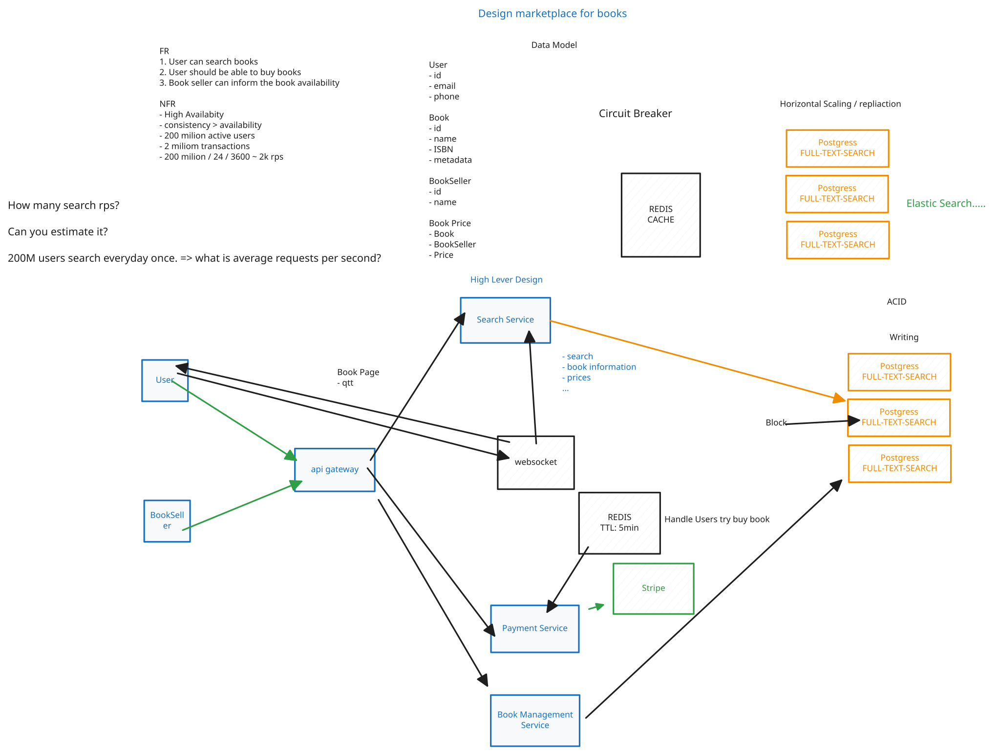

# 📚 Book Marketplace - System Architecture

Este repositório contém a documentação da arquitetura de alto nível (HLD) para a plataforma **Book Marketplace**. O sistema foi desenhado para suportar alta carga, garantindo consistência transacional nas compras e pesquisas eficientes para milhões de utilizadores.

## 🎯 Requisitos do Sistema

### Requisitos Funcionais (FR)
* O utilizador pode pesquisar livros.
* O utilizador deve conseguir comprar livros.
* O vendedor pode informar/atualizar a disponibilidade dos livros.

### Requisitos Não-Funcionais (NFR) e Estimativas
* **Disponibilidade e Consistência:** Alta Disponibilidade, priorizando a Consistência sobre a Disponibilidade (CP) em fluxos críticos de pagamento.
* **Escala:** ~200 milhões de utilizadores ativo[.
* **Transações:** ~2 milhões de transações.
* **Tráfego de Pesquisa:** Assumindo 1 pesquisa diária por utilizador ativo: `200M / 24 / 3600 ≈ 2.314 Requests per Second (RPS)`.

---

## 🏗️ Arquitetura e Componentes (HLD)

A arquitetura baseia-se num modelo de microsserviços interligados através de um **API Gateway**.

### Microsserviços Principais
1. **Search Service:** Serviço otimizado para lidar com elevados volumes de leitura (>2k RPS), devolvendo informações dos livros e preços.
2. **Book Management Service:** Ponto de interação dos vendedores (`BookSeller`) para gerir o catálogo e o stock físico.
3. **Payment Service:** Orquestra a jornada de checkout. Integra-se com o gateway de pagamentos **Stripe**.
4. **WebSocket Service:** Responsável por emitir atualizações em tempo real sobre a quantidade ("qtt") de livros disponíveis na página do produto (`Book Page`).

### Estratégia de Dados e Persistência
O sistema utiliza um modelo relacional (PostgreSQL) com uma estratégia de escalonamento horizontal para leituras:
* **Master DB (Write):** Garante conformidade ACID para a escrita de transações e gestão de inventário.
* **Read Replicas (Read):** Múltiplas réplicas utilizando `FULL-TEXT-SEARCH` para suportar o Search Service de forma isolada.
* *Evolução Planeada:* Migração da carga de pesquisa complexa para um cluster **ElasticSearch**, otimizando o tempo de resposta perante a escala projetada.

### Mecanismos de Resiliência e Consistência
* **Cache em Memória (Redis):** Utilizado em dois pontos estratégicos:
  1. Absorção de carga de leitura pesada (atuando de forma complementar aos padrões de Circuit Breaker da rede).
  2. **Distributed Lock (Reserva de Stock):** Quando um utilizador tenta comprar um livro, o item recebe um "bloqueio" no Redis com um **TTL de 5 minutos**. Isto previne que o mesmo item seja vendido a duas pessoas diferentes enquanto o pagamento é processado no Stripe.

---

## 🚀 Pontos de Melhoria Contínua (Design Review)
Embora a arquitetura atual resolva o problema inicial, os seguintes pontos foram identificados para iterar em versões futuras:
* **Assincronismo:** Introdução de um Message Broker (ex: Kafka) entre o serviço de pagamento e as escritas no banco de dados para evitar bloqueios.
* **Otimização de Tempo Real:** Substituição do `WebSocket` por *Server-Sent Events (SSE)* para a contagem de inventário, reduzindo o overhead nas ligações dos clientes.
* **Sharding:** Implementação de particionamento (sharding) na base de dados de escrita (Postgres Master) caso o limite vertical de I/O seja atingido.